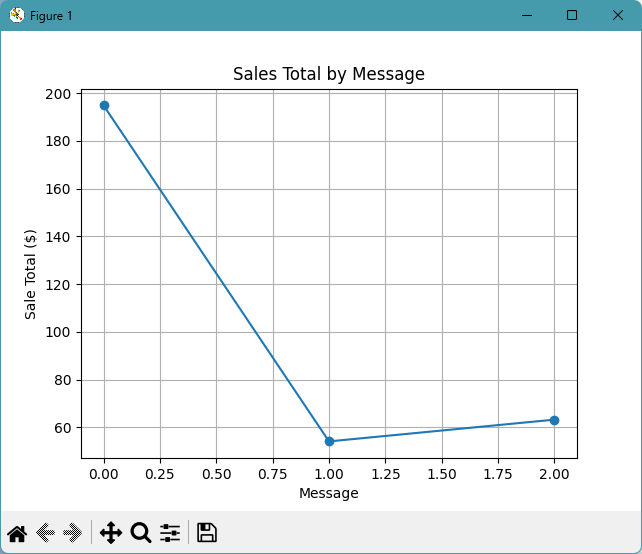

# Project Instructions

## WEDNESDAY: Complete Workflow Phase 1-3

Follow the instructions in
[⭐ **Workflow: Apply Example**](https://denisecase.github.io/pro-analytics-02/workflow-b-apply-example-project/).

Complete:

1. Phase 1. **Start & Run** - copy the project and confirm it runs
2. Phase 2. **Change Authorship** - update the project to your name and GitHub account
3. Phase 3. **Read & Understand** - review the project structure and code

## FRIDAY/SUNDAY: Complete Workflow Phases 4-5

Complete:

1. Phase 4. **Make a Technical Modification**
2. Phase 5. **Apply the Skills to a New Problem**

---

## Topic

Streaming visualization using Kafka, validation, enrichment, and live charts.

This project focuses on visualizing streaming messages as they are consumed.

The case project:

- produces sales messages to a Kafka topic
- consumes messages from Kafka
- validates each message against a data contract
- enriches valid messages with derived fields
- updates a live chart as messages arrive
- writes consumed records to a local CSV file

## Example Files

Review these files before making your changes:

| File | Purpose |
| --- | --- |
| `src/streaming/kafka_producer_case.py` | Produces sales messages to Kafka |
| `src/streaming/kafka_consumer_case.py` | Consumes, validates, enriches, and charts messages |
| `src/streaming/data_validation/data_contract_case.py` | Defines the data contract |
| `src/streaming/data_engineering/derived_fields.py` | Computes derived fields |
| `src/streaming/visualizations/live_visualizations_case.py` | Updates the live chart |

The example data starts in:

```text
data/sales.csv
```

Run commands are in `README.md`.

## Phase 4: Make a Small Technical Modification

Copy the consumer case file:

```text
src/streaming/kafka_consumer_case.py
```

Rename your copy:

```text
src/streaming/kafka_consumer_yourname.py
```

Run your copied file and make one small change.

Good options include:

- change the **KAFKA_TOPIC** name in `.env`
- change the **PRODUCER_MESSAGE_COUNT** in `.env`
- change the **PRODUCER_MESSAGE_INTERVAL_SECONDS** in `.env`
- change the live chart to use a different field
- change the chart title or axis labels
- write an additional output CSV field
- change what gets logged for each consumed message

Keep your change small enough that you can explain it clearly.

## Optional: Modify the Producer

You can leave the producer unchanged.

To customize the producer:

1. Copy `src/streaming/kafka_producer_case.py`.
2. Rename it `src/streaming/kafka_producer_yourname.py`.
3. Change the message source or message fields.
4. Run the full pipeline again.

## Phase 5: Apply the Skills

Apply the same streaming visualization pattern to your own scenario.

You may:

- extend the current sales example
- change the live chart to use a different field
- create a different live chart
- add a second chart
- use a different dataset
- compare visual patterns across message groups

Document your work in `docs/index.md`.

Explain:

- what scenario or dataset you chose
- what changed from the case example
- what your consumer does to each message
- what your chart shows
- what patterns or insights you observed in the stream


